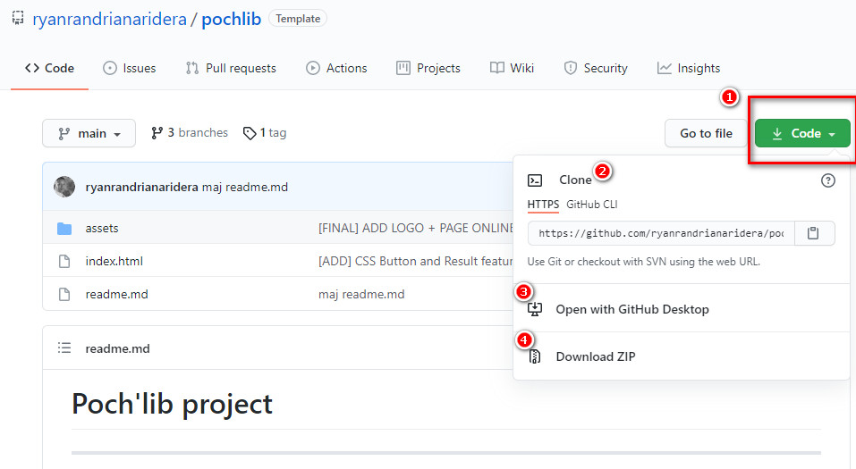

# Poch'lib project

---

## Table of contents

---

1. [General info](#general-info)
2. [Installation](#installation)
3. [Execution](#execution)
4. [Funtionalities](#functionalities)
5. [Technologies](#technologies)

## General Info

---

Poch’lib is a web responsive book management app developed with mobile first approach and worked with somes devices :

| Type           | Devices                             |
| -------------- | ----------------------------------- |
| &check; Small  | phone, portrait tablets             |
| &check; Medium | laptops/desktops, landscape tablets |
| &check; Large  | large laptops and desktops          |

## Installation

---

About the installation.

> Step 1 : Click on the top right button "code" [1] and choose "Download zip" [4].

> Step 2 : On your computer, go to the folder downloaded.

> Step 3 : Unzip the folder

Other options are possible :

[2] Clone the repository

[3] Open with Github desktop

## Execution

---

Open the file downloaded and unzipped **_"index.html"_** with your browser or open it with a local server ( ex : plugin Live Server + [Visual Studio Code](https://code.visualstudio.com/) for example).

It's possible to test directly this website online ==> [POCH'LIB APP ONLINE TEST](https://ryanrandrianaridera.github.io/pochlib/) <==

## Functionalities

---

### Search a book

- Click on button **_Ajouter un livre_**
- Enter title & author name of a book and click on submit button **_Rechercher_** or cancel the search with button **_Annuler_**

### Add a book in "Ma poch'liste"

- Click on the icon bookmark on the top right of book description. The book is added on your favorite list.

### Remove a book in "Ma poch'liste"

- Click on the icon trash on the top right of book description that was bookmarked precedently.
  The book is removed on your favorite list.

### Search Method

The Google Books API's is used to fetch the books with GET METHOD and display them in "Résultats de recherche" and "Ma poch'liste".

### Storage

The sessionStorage API is used to add and remove items.
When the page is reloaded,
When you closed your browser, everything is deleted.

## Technologies

---

A list of technologies used within the project:

**Enjoy it !**

